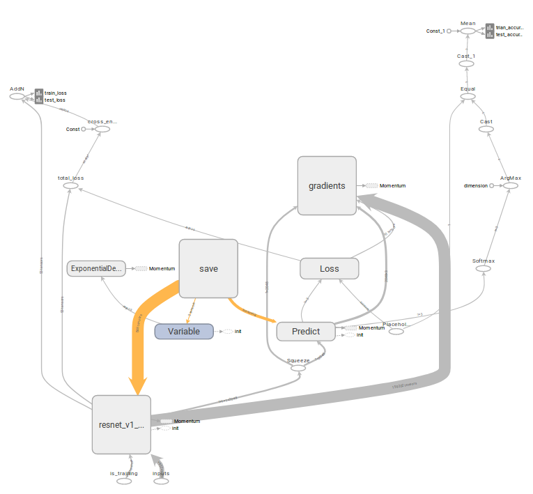

# Classification Project based on Tensorflow
这是一份基于Tensorlflow的分类代码，用于deep-learning、Tensorflow的学习。
#### 相关信息
    开始日期：2019.6.9
#### 环境要求
    Tensoflow1.9.0+
    pyyaml
    torch
    easydict
    opencv-python
    Some other libraries (find what you miss when running the code. hhhhh~)
#### 实现模型
    ResNet
#### 数据准备
    1.cifar10:
    训练的时候直接运行训练代码即可，可以自行下载解压；
    2.captcha_images:
    datasets下新建captcha_images，在captcha_images内新建captcha_images/images/train和val,
    分别用来放置训练和验证图片；
    运行datasets下的create_classification_data.py即可生成这个小型数据集；
    3.easy:
    链接: https://pan.baidu.com/s/11Oyo2ESoShI-rLV8xTH-Eg 提取码: js65 
    该数据集下载解压后放在datasets文件夹下即可；
#### 预训练模型
    1.在classification_Tensorflow_Proj内新建pretrained_models放置需要的预训练模型,
    若找不到预训练模型，则下载下来放入指定的位置，模型保存在谷歌的开源代码models/research/slim中；
#### 使用方法
    1.实验名在exp_configs文件夹下以文件夹名体现,格式：数据集_网络模型；
    2.模型输出在exp_output，需要在classification_Tensorflow_Proj路径下新建一个exp_output，
    3.exp_output内新建对应的实验名文件夹，格式与exp_configs内保持一致;
    4.运行方法是先在exp_configs里做好实验配置(可以使用默认配置)，再在train.py中修改--config-path
    为你想做实验的文件夹名，再运行train.py即可;
    5.tensorboard查看相关实验参数指标以及训练计算图，在exp_output/你的实验/event/路径下，于终端输入：
        tensorboard --logdir=./  
      效果示例：
   

   

        
#### 实现功能
    1.使用captcha生成简单的分类数据集，标签在图片名中；
    2.训练模型，生成ckpt；
    3.模型训练的同时对测试集进行测试；
    4.模型训练的参数打印出来，同时保存在exp_output/“你的实验”/log.txt
    方便之后的对比查看；
    5.计算模型测试的速度；
    6.读取cktp继续训练
    7.tensorboard显示图片
    8.使用保存好的模型进行前向推断测试

